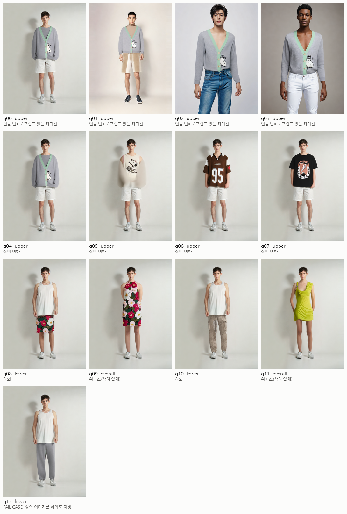
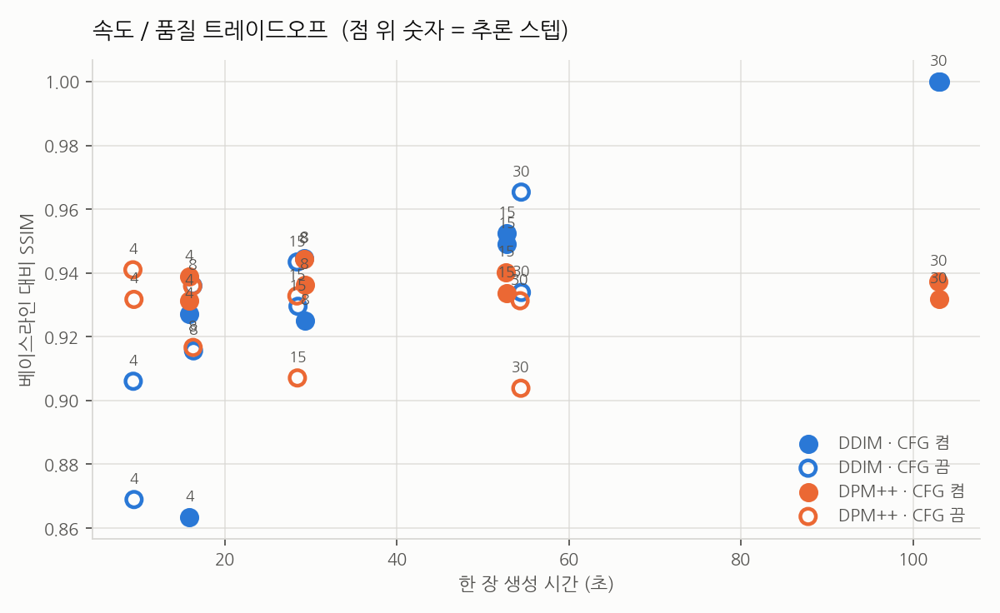

# 테스트 결과

CatVTON 기반 가상 피팅의 품질 한계와 속도/품질 트레이드오프를 측정한 결과.

실행: `python scripts/benchmark.py --suite all` → `python scripts/make_report.py`

테스트 이미지는 재현성을 위해 CatVTON 저장소의 데모 이미지를 사용했다.

## 1. 품질 시나리오

| ID | 옷 종류 | 시나리오 | 시간(초) |
|---|---|---|---|
| q00 | upper | 인물 변화 / 프린트 있는 카디건 | 103.2 |
| q01 | upper | 인물 변화 / 프린트 있는 카디건 | 102.9 |
| q02 | upper | 인물 변화 / 프린트 있는 카디건 | 102.8 |
| q03 | upper | 인물 변화 / 프린트 있는 카디건 | 103.0 |
| q04 | upper | 상의 변화 | 103.0 |
| q05 | upper | 상의 변화 | 102.9 |
| q06 | upper | 상의 변화 | 103.0 |
| q07 | upper | 상의 변화 | 103.0 |
| q08 | lower | 하의 | 103.1 |
| q09 | overall | 원피스(상하 일체) | 103.1 |
| q10 | lower | 하의 | 103.0 |
| q11 | overall | 원피스(상하 일체) | 103.0 |
| q12 | lower | FAIL CASE: 상의 이미지를 하의로 지정 | 103.0 |

## 2. 속도 / 품질 트레이드오프

| 스케줄러 | 스텝 | CFG | 시간(초) | 배속 | SSIM vs 베이스라인 | SSIM vs 같은 샘플러 30스텝 |
|---|---|---|---|---|---|---|
| DDIM | 30 | on | 103.0 | 1.0x | 1.000 | 1.000 |
| DDIM | 30 | off | 54.5 | 1.9x | 0.950 | 0.950 |
| DDIM | 15 | on | 52.8 | 2.0x | 0.951 | 0.951 |
| DDIM | 15 | off | 28.4 | 3.6x | 0.936 | 0.936 |
| DDIM | 8 | on | 29.3 | 3.5x | 0.935 | 0.935 |
| DDIM | 8 | off | 16.3 | 6.3x | 0.926 | 0.926 |
| DDIM | 4 | on | 15.8 | 6.5x | 0.895 | 0.895 |
| DDIM | 4 | off | 9.4 | 11.0x | 0.887 | 0.887 |
| DPM++ | 30 | on | 103.0 | 1.0x | 0.935 | 1.000 |
| DPM++ | 30 | off | 54.4 | 1.9x | 0.918 | 0.926 |
| DPM++ | 15 | on | 52.7 | 2.0x | 0.937 | 0.993 |
| DPM++ | 15 | off | 28.4 | 3.6x | 0.920 | 0.929 |
| DPM++ | 8 | on | 29.2 | 3.5x | 0.940 | 0.984 |
| DPM++ | 8 | off | 16.2 | 6.3x | 0.926 | 0.937 |
| DPM++ | 4 | on | 15.8 | 6.5x | 0.935 | 0.950 |
| DPM++ | 4 | off | 9.3 | 11.0x | 0.936 | 0.950 |

SSIM은 "같은 그림인가"를 재는 지표이지 "잘 만들었는가"가 아니다. 두 기준을 함께 본다.

- **vs 베이스라인**: 현재 운영 설정(DDIM 30스텝, CFG on) 대비 결과가 얼마나 달라지는가.
  샘플러를 바꾸면 같은 스텝이어도 그림이 달라지므로 DPM++는 이 값이 구조적으로 낮게 나온다.
- **vs 같은 샘플러 30스텝**: 스텝을 줄여서 생긴 열화만 분리한 값. 가속의 대가를 보려면 이쪽을 본다.

## 3. 측정 환경

- 실행 플랫폼: Kaggle / GPU: Tesla P100-PCIE-16GB
  (이 실행의 CSV에는 환경 컬럼이 없어 커널 로그에서 확인한 값이다.
   이후 실행부터는 benchmark가 CSV에 직접 기록한다)
- Python 3.9 venv, torch 2.1.2+cu121, fp16
- 해상도 768×1024, AutoMasker(DensePose+SCHP) 자동 마스크
- 시간은 마스크 생성 + 확산 추론 합계이며 모델 로딩(약 40초)은 제외
- GPU에 따라 절대 시간은 달라진다 (같은 설정에서 T4 약 73초, P100 약 103초).
  배속과 SSIM은 같은 GPU 안에서의 상대 비교이므로 영향받지 않는다.

## 4. 관찰된 결과

### 프린트 재현은 "크기"가 가른다
q05(스누피 나시)와 q07(원형 로고 티셔츠)은 프린트가 뭉개지지만, **q06의 등번호 "95"는
선명하게 재현된다.** VAE가 768×1024를 96×128 잠재공간으로 8배 줄이기 때문에, 가슴팍의
작은 그림은 10~20픽셀로 뭉개지는 반면 큰 숫자·색 면적은 살아남는다.
니트 조직, 민트색 플래킷 같은 반복 패턴·색 면적도 잘 유지된다.

→ 프로젝트 스코프상 문제되지 않는다. 목표는 프린트 재현이 아니라 **사이즈에 따른 핏**이므로,
   "그래픽 디테일은 참고용, 실루엣과 핏이 본 기능"으로 명시하면 된다.

### 인물 의존성은 낮다
q00~q03은 피부톤과 포즈가 다른 인물 4명에게 같은 카디건을 입힌 것인데 모두 안정적이다.
데모 이미지가 전부 정면 전신 정자세라는 점은 감안해야 한다 (측면·팔 겹침은 미검증).

### 카테고리 지시가 옷 이미지보다 우선한다
q12는 상의(카디건) 이미지를 `cloth_type='lower'`로 지정한 의도적 실패 케이스인데,
결과는 깨지지 않고 **회색 스웨트팬츠**가 생성됐다. 모델이 옷 이미지에서 색·질감만 참조하고
형태는 마스크가 지시한 부위에 맞춰 새로 그린다는 뜻이다.
하의 상품컷이 없어도 하의 합성이 되던 앞선 관찰과 일치한다.

### 원피스는 체형과 충돌한다
q09·q11은 남성 모델에 여성 원피스를 입힌 경우로, 다리 길이나 허리선이 부자연스럽다.
옷과 인물의 성별·체형이 어긋나면 품질이 떨어진다.

## 5. 가속 결론

**샘플러 교체가 스텝 감소의 대가를 거의 없앤다.** 같은 샘플러 30스텝 대비 SSIM으로 보면:

| 스텝 | DDIM | DPM++ |
|---|---|---|
| 15 | 0.951 | **0.993** |
| 8 | 0.935 | **0.984** |
| 4 | 0.895 | **0.950** |

DDIM은 스텝을 줄일수록 무너지지만(0.895), DPM++는 8스텝에서도 30스텝과 거의 같은 그림을
낸다(0.984). 이 repo가 DDIM을 `eta=1.0`(확률적)으로 쓰기 때문에 저스텝에서 특히 불리하다.

**권장 운영 설정: DPM++ 8스텝 + CFG on** — P100 기준 29초(3.5배), 품질 손실 1.6%.
더 빠르게 가야 하면 **DPM++ 4스텝 + CFG off로 9.3초(11배)** 까지 내려가지만,
CFG를 끈 결과는 SSIM만으로 판단할 수 없으므로 육안 확인이 필요하다.

남은 병목: 4스텝 구간에서는 마스크 생성(AutoMasker)이 9.3초 중 1.1초를 차지한다.
5초 밑으로 내리려면 확산뿐 아니라 마스크 단계도 손봐야 한다.
