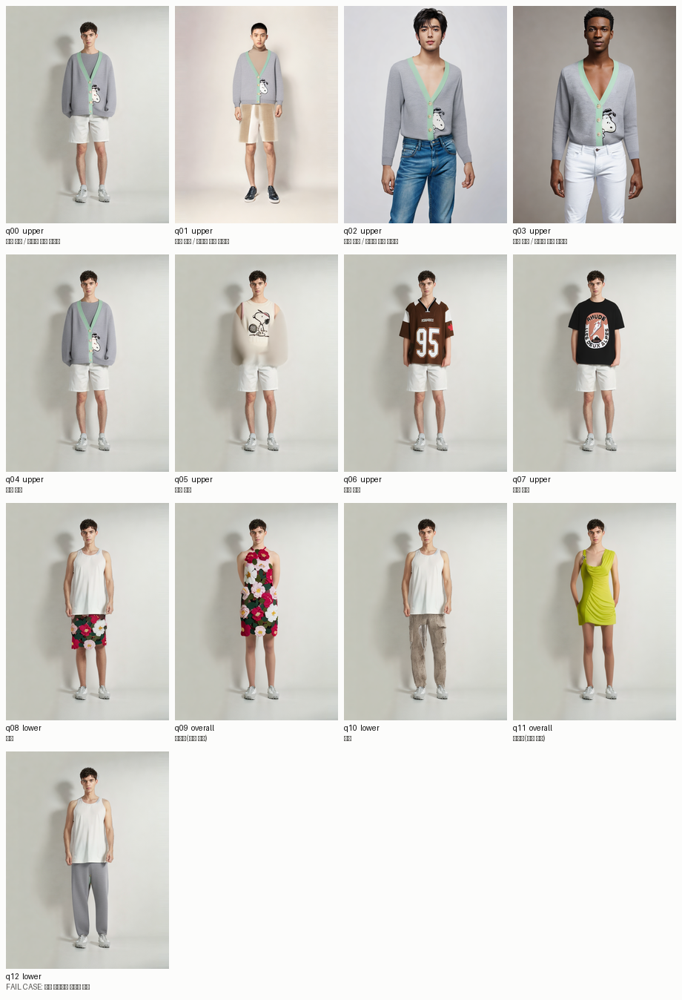
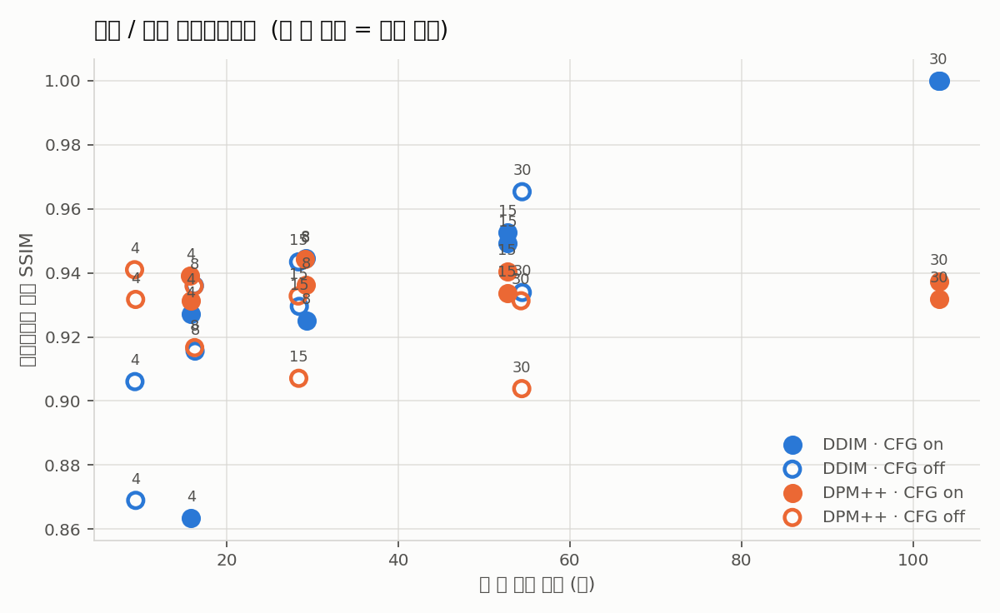

# 테스트 결과

CatVTON 기반 가상 피팅의 품질 한계와 속도/품질 트레이드오프를 측정한 결과.

실행: `python scripts/benchmark.py --suite all` → `python scripts/make_report.py`

테스트 이미지는 재현성을 위해 CatVTON 저장소의 데모 이미지를 사용했다.

## 1. 품질 시나리오

| ID | 옷 종류 | 시나리오 | 시간(초) |
|---|---|---|---|
| q00 | upper | 인물 변화 / 프린트 있는 카디건 | 103.2 |
| q01 | upper | 인물 변화 / 프린트 있는 카디건 | 102.9 |
| q02 | upper | 인물 변화 / 프린트 있는 카디건 | 102.8 |
| q03 | upper | 인물 변화 / 프린트 있는 카디건 | 103.0 |
| q04 | upper | 상의 변화 | 103.0 |
| q05 | upper | 상의 변화 | 102.9 |
| q06 | upper | 상의 변화 | 103.0 |
| q07 | upper | 상의 변화 | 103.0 |
| q08 | lower | 하의 | 103.1 |
| q09 | overall | 원피스(상하 일체) | 103.1 |
| q10 | lower | 하의 | 103.0 |
| q11 | overall | 원피스(상하 일체) | 103.0 |
| q12 | lower | FAIL CASE: 상의 이미지를 하의로 지정 | 103.0 |

## 2. 속도 / 품질 트레이드오프

| 스케줄러 | 스텝 | CFG | 시간(초) | 배속 | SSIM |
|---|---|---|---|---|---|
| DDIM | 30 | on | 103.0 | 1.0x | 1.000 |
| DDIM | 30 | off | 54.5 | 1.9x | 0.950 |
| DDIM | 15 | on | 52.8 | 2.0x | 0.951 |
| DDIM | 15 | off | 28.4 | 3.6x | 0.936 |
| DDIM | 8 | on | 29.3 | 3.5x | 0.935 |
| DDIM | 8 | off | 16.3 | 6.3x | 0.926 |
| DDIM | 4 | on | 15.8 | 6.5x | 0.895 |
| DDIM | 4 | off | 9.4 | 11.0x | 0.887 |
| DPM++ | 30 | on | 103.0 | 1.0x | 0.935 |
| DPM++ | 30 | off | 54.4 | 1.9x | 0.918 |
| DPM++ | 15 | on | 52.7 | 2.0x | 0.937 |
| DPM++ | 15 | off | 28.4 | 3.6x | 0.920 |
| DPM++ | 8 | on | 29.2 | 3.5x | 0.940 |
| DPM++ | 8 | off | 16.2 | 6.3x | 0.926 |
| DPM++ | 4 | on | 15.8 | 6.5x | 0.935 |
| DPM++ | 4 | off | 9.3 | 11.0x | 0.936 |

SSIM은 베이스라인(DDIM 30스텝, CFG on) 결과와의 구조적 유사도다. 1.0에 가까울수록
베이스라인과 같은 그림이라는 뜻이며, 베이스라인 자체의 품질이 좋다는 의미는 아니다.

## 3. 측정 환경

- Colab T4 (16GB), Python 3.9 venv, torch 2.1.2+cu121, fp16
- 해상도 768×1024, AutoMasker(DensePose+SCHP) 자동 마스크
- 시간은 마스크 생성 + 확산 추론 합계이며 모델 로딩(약 40초)은 제외
